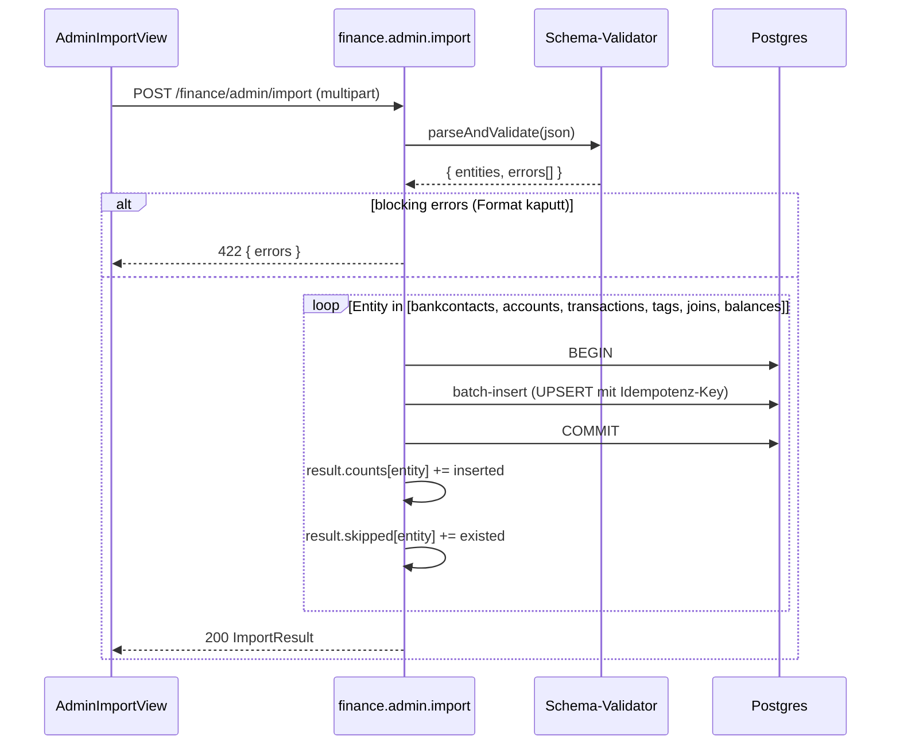

# Finance — Datenimport aus Finanzkraft-JSON

Ziel: Einmaliger Import historischer Finanzdaten aus der Legacy-Finanzkraft-
App als JSON-Dump in die neue fk-encore-Datenbank. Bewusst eingeschränkter
Scope: **nur nicht-user-spezifische Daten**. Credentials, ACL und
Transaktions-Status werden **nicht** migriert, sondern manuell bzw. durch
den ersten Live-Sync erneuert.

Status: Feature-Plan, Umsetzung in Etappen.

---

## 1. Scope und Endpoint

```
POST /finance/admin/import
Content-Type: multipart/form-data
Permission:   finance.admin
Body:         file=<finanzkraft-export.json>
```

Der Endpoint ist nicht für reguläre User gedacht — `finance.admin` liegt
im `adminExcludedPermissions`-Set (siehe `finance-data-model.md` §5) und
wird explizit an genau einen Admin vergeben.

Response:
```ts
interface ImportResult {
  counts: {
    bankcontacts: number;
    accounts: number;
    transactions: number;
    tags: number;
    tagJoins: number;
  };
  skipped: {
    bankcontacts: number;    // schon vorhanden (Idempotenz)
    accounts: number;
    transactions: number;
  };
  validationErrors: Array<{ entity: string; row: number; message: string }>;
}
```

---

## 2. Was wird importiert

| Entität | Import? | Bemerkung |
|---|---|---|
| Bankkontakt-Stammdaten | ✅ | ohne Credentials, ohne User-Zuordnung |
| Konten-Stammdaten | ✅ | ohne ACL |
| Transaktionen | ✅ | ohne Status, `source='import'` im `finance_account_balance` |
| Tags | ✅ | `source='user'` (historisch bestätigt) |
| `finance_tag_transaction` | ✅ | historische Tag-Zuweisungen, `confidence=NULL` |
| `finance_account_access` (ACL) | ❌ | nachträglich manuell per `AccountAssignmentView` |
| `finance_transaction_status` | ❌ | Tabelle existiert nicht im neuen Schema |
| Credentials | ❌ | vom User neu erfasst |
| Kategorien / Rules | ❌ | entfallen im neuen Design (siehe `finance-tagging-and-ai.md`) |
| Saldo-Historie | ✅ (optional) | wenn im Export vorhanden, mit `source='import'` |

Die ACL bleibt bewusst außen vor, weil sich das Legacy-Rollenmodell
(`Fk_AccountReader`/`Fk_AccountWriter`) nicht 1:1 auf den neuen User-
Stamm abbilden lässt und der Admin die Zuordnung ohnehin prüfen will.

---

## 3. Import-Reihenfolge

Die Reihenfolge ist FK-erzwungen:

1. **Bankkontakte** (`finance_bankcontact`) — Stammdaten ohne
   `credentials_encrypted`, `sync_times = []`.
2. **Konten** (`finance_account`) — FK auf Bankkontakte.
3. **Transaktionen** (`finance_transaction`) — FK auf Konten.
4. **Tags** (`finance_tag`) — eigenständig, aber vor den Joins.
5. **`finance_tag_transaction`** — FK auf Tags + Transaktionen.
6. **`finance_account_balance`** (optional) — FK auf Konten.

Jede Stufe läuft in einer eigenen DB-Transaktion. Fehler in Stufe N
rollen nur diese Stufe zurück; vorangegangene Stufen bleiben persistiert.
Validierungsfehler pro Zeile werden gesammelt und in der Response
zurückgegeben — **kein** Teil-Abbruch bei einzelnen defekten Zeilen.

---

## 4. Ablauf



---

## 5. Idempotenz (Re-Import)

Ein Re-Import der gleichen JSON darf keine Duplikate erzeugen. Erkennung
über **natürliche Schlüssel**:

| Entität | Natürlicher Schlüssel | Verhalten bei Treffer |
|---|---|---|
| `finance_bankcontact` | `(blz, login)` | skip (keine Überschreibung von Credentials/Sync-Times) |
| `finance_account` | `iban` (Fallback: `bankcontact_id + account_number`) | skip |
| `finance_transaction` | `(account_id, dedupe_hash)` (siehe `finance-data-model.md` §3) | skip |
| `finance_tag` | `(name, source='user')` | skip |
| `finance_tag_transaction` | `(tag_id, transaction_id)` | skip |

Skipped-Counts werden in der Response zurückgegeben, damit der Admin
nachvollziehen kann, warum ein Re-Import weniger neu einfügt als
erwartet.

---

## 6. Nachgelagerter Schritt: User-Zuordnung

Direkt nach dem Import sind **keine Konten** für reguläre User sichtbar
— `finance_account_access` ist leer, und jeder Query auf Konten läuft
durch den ACL-Filter (siehe `finance-data-model.md` §5).

Der Admin öffnet `AccountAssignmentView` (siehe `finance-frontend.md`)
und legt pro Konto fest, welche fk-encore-User es als `read` oder
`write` sehen. Credentials erfasst jeder Nutzer selbst über
`BankcontactDetailView`, bevor der erste Live-Sync startet.

---

## 7. Performance

- **Batch-Größe**: 1000 Zeilen pro Insert (Transaktionen, Tag-Joins).
- **Drizzle `values()`-Array** statt Einzel-Inserts, um Round-Trips zu
  sparen.
- **Indizes**: Duplikat-Check aus §5 läuft gegen die Unique-Indizes aus
  `finance-data-model.md` §3; bei 100k Transaktionen liegt der Import
  erfahrungsgemäß im Bereich weniger Minuten.
- **Timeout**: der Endpoint läuft als normale Encore-API; bei sehr
  großen Exporten ggf. auf asynchrones Import-Job-Pattern (Status-
  Polling) umstellen. Für MVP reicht der synchrone Endpoint.

---

## 8. Filesystem-Dropbox + tägliches Backup

Der HTTP-Pfad in `AdminImportView` läuft in das 5-Minuten-Gateway-
Timeout, sobald der Import länger braucht — eine echte Migration mit
~50 000 Transaktionen ist deutlich darüber. Für genau diese Fälle gibt
es einen Filesystem-Pfad, der ohne HTTP auskommt:

### 8.1 Import-Dropbox

`finance/import-pending.ts` registriert einen Cron alle **5 Minuten**,
der `${FINANCE_IMPORT_DIR}/` (Default `/data/finance-import` →
gemountet als `/mnt/data/finance-import`) nach Dateien mit dem Suffix
**`*.pending.json`** durchsucht.

- Jede gefundene Datei wird mit `wipe_first: true` durch
  `runImport()` geschickt — die Dropbox-Semantik ist *"diese Datei IST
  der gewünschte Finanz-Stand"*.
- Erfolg: rename auf `<basename>.imported-<ISO-timestamp>.json`. Bei
  Validierungsfehlern liegt eine Schwester-Datei
  `<basename>.imported-<ts>.errors.json` daneben.
- Fehler: rename auf `<basename>.failed-<ts>.json` plus
  `<basename>.failed-<ts>.error.txt`.

Singleton-Mutex auf Modul-Ebene verhindert überlappende Ticks bei
sehr großen Imports; während ein Tick läuft, schreibt der nächste nur
`skipped_locked: true` und beendet sich.

Logging: Stage-Boundaries via `encore.dev/log`, Tx-Stage zusätzlich
ein Heartbeat alle **1000 Zeilen** mit Counts + Elapsed — sodass ein
50k-Lauf ~50 Progress-Lines im Container-Log produziert statt 5
Minuten Stille.

### 8.2 Tägliches Backup

`finance/export-cron.ts` schreibt um **03:00 UTC** einen vollständigen
Snapshot aller `finance_*`-User-Tabellen nach
`${FINANCE_EXPORT_DIR}/finance-export-YYYY-MM-DD.json` (Default
`/data/finance-export` → `/mnt/data/finance-export`). Format ist
exakt das gleiche wie der `runImport`-Input, sodass der Worst-Case-
Restore ein einziger `cp` ist:

```sh
cp /mnt/data/finance-export/finance-export-2026-04-20.json \
   /mnt/data/finance-import/restore-2026-04-25.pending.json
# nächster 5-min-Tick wipt + restored
```

Rotation: Standardmäßig werden die letzten 30 Snapshots behalten,
ältere gelöscht (`FINANCE_EXPORT_KEEP` env var override). Da der
Filename den Tag enthält, überschreibt sich ein Same-Day-Re-Run
selbst — keine Doppel-Snapshots.

### 8.3 Was im Snapshot steckt

| Tabelle | Im Snapshot? | Anmerkung |
|---|---|---|
| `finance_currency` | ✓ | Wird beim Import in Stage 0 idempotent geseedet. |
| `finance_bankcontact` | ✓ | Ohne `credentials_encrypted` (key-locked, Klartext nicht herstellbar). |
| `finance_account` | ✓ | inkl. `fints_account_number` für Live-Sync-Kontinuität. |
| `finance_transaction` | ✓ | Alle Spalten inkl. SEPA-Felder aus 0055. |
| `finance_tag` (source='user') | ✓ | AI-Vorschläge nicht — werden vom LLM neu gerechnet. |
| `finance_tag_transaction` (user-Tags) | ✓ | Composite-Key `(account, booking_date, dedupe_hash)`. |
| `finance_account_balance` | ✗ | Wird durch nächsten Sync neu abgeleitet. |
| `finance_account_access` | ✗ | Admin setzt manuell via `AccountAssignmentView`. |
| `finance_tan_session` | ✗ | Transient (10 min TTL). |

### 8.4 Volume-Setup (`docker-compose.yml`)

Beide Verzeichnisse sind als bind-Mounts auf den Host gehängt:

```yaml
finance_import:
  driver: local
  driver_opts: { type: none, o: bind, device: /Users/anton/vivanty_data/finance-import }
finance_export:
  driver: local
  driver_opts: { type: none, o: bind, device: /Users/anton/vivanty_data/finance-export }
```

Die Hostpfade kannst du anpassen. Für Multi-Host-Backups einfach den
Export-Pfad auf z.B. einen NAS/SMB-Mount zeigen lassen.

---

## 9. Referenzen

| Stelle | Wofür |
|---|---|
| `finance-data-model.md` §3 | Duplikaterkennung, `dedupe_hash` |
| `finance-data-model.md` §5 | Permission `finance.admin`, ACL-Filter |
| `finance-frontend.md` | `AdminImportView`, `AccountAssignmentView` |
| `finance/import-pending.ts` | Dropbox-Cron, Suffix-Pattern, Singleton-Lock |
| `finance/export-cron.ts` | Daily-Snapshot, Rotation |

---

## 10. Offene Punkte

- **Saldo-Historie**: Welche `as_of`-Granularität liegt im Export vor
  (pro Buchung, pro Tag, pro Monat)? Aktuell wird sie weder im Snapshot
  noch im Import berücksichtigt — entsteht durch den nächsten Sync neu.
- **Push-Notification bei failed-Imports**: Aktuell bleibt eine
  `*.failed-…json` einfach im Verzeichnis liegen. Optional könnte
  push.service.ts den Owner-User anpingen.
