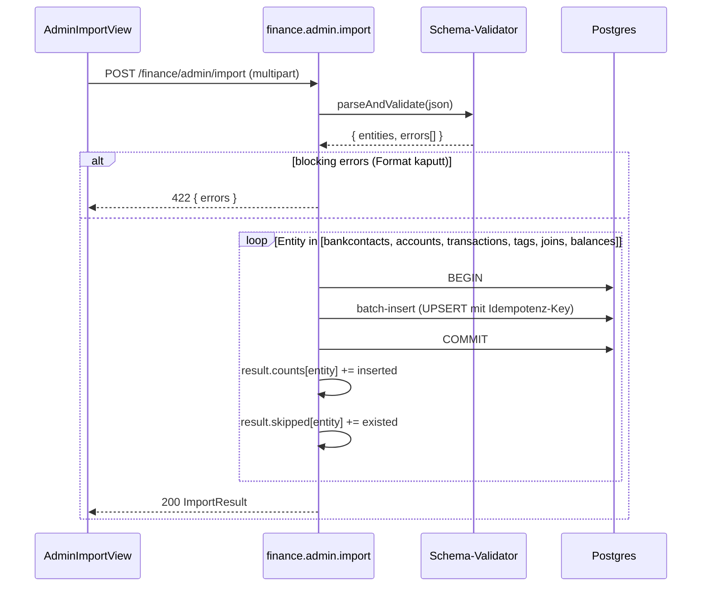

# Finance — Datenimport aus Finanzkraft-JSON

Ziel: Einmaliger Import historischer Finanzdaten aus der Legacy-Finanzkraft-
App als JSON-Dump in die neue fk-encore-Datenbank. Bewusst eingeschränkter
Scope: **nur nicht-user-spezifische Daten**. Credentials, ACL und
Transaktions-Status werden **nicht** migriert, sondern manuell bzw. durch
den ersten Live-Sync erneuert.

Status: Feature-Plan, Umsetzung in Etappen.

---

## 1. Scope und Endpoint

```
POST /finance/admin/import
Content-Type: multipart/form-data
Permission:   finance.admin
Body:         file=<finanzkraft-export.json>
```

Der Endpoint ist nicht für reguläre User gedacht — `finance.admin` liegt
im `adminExcludedPermissions`-Set (siehe `finance-data-model.md` §5) und
wird explizit an genau einen Admin vergeben.

Response:
```ts
interface ImportResult {
  counts: {
    bankcontacts: number;
    accounts: number;
    transactions: number;
    tags: number;
    tagJoins: number;
  };
  skipped: {
    bankcontacts: number;    // schon vorhanden (Idempotenz)
    accounts: number;
    transactions: number;
  };
  validationErrors: Array<{ entity: string; row: number; message: string }>;
}
```

---

## 2. Was wird importiert

| Entität | Import? | Bemerkung |
|---|---|---|
| Bankkontakt-Stammdaten | ✅ | ohne Credentials, ohne User-Zuordnung |
| Konten-Stammdaten | ✅ | ohne ACL |
| Transaktionen | ✅ | ohne Status, `source='import'` im `finance_account_balance` |
| Tags | ✅ | `source='user'` (historisch bestätigt) |
| `finance_tag_transaction` | ✅ | historische Tag-Zuweisungen, `confidence=NULL` |
| `finance_account_access` (ACL) | ❌ | nachträglich manuell per `AccountAssignmentView` |
| `finance_transaction_status` | ❌ | Tabelle existiert nicht im neuen Schema |
| Credentials | ❌ | vom User neu erfasst |
| Kategorien / Rules | ❌ | entfallen im neuen Design (siehe `finance-tagging-and-ai.md`) |
| Saldo-Historie | ✅ (optional) | wenn im Export vorhanden, mit `source='import'` |

Die ACL bleibt bewusst außen vor, weil sich das Legacy-Rollenmodell
(`Fk_AccountReader`/`Fk_AccountWriter`) nicht 1:1 auf den neuen User-
Stamm abbilden lässt und der Admin die Zuordnung ohnehin prüfen will.

---

## 3. Import-Reihenfolge

Die Reihenfolge ist FK-erzwungen:

1. **Bankkontakte** (`finance_bankcontact`) — Stammdaten ohne
   `credentials_encrypted`, `sync_times = []`.
2. **Konten** (`finance_account`) — FK auf Bankkontakte.
3. **Transaktionen** (`finance_transaction`) — FK auf Konten.
4. **Tags** (`finance_tag`) — eigenständig, aber vor den Joins.
5. **`finance_tag_transaction`** — FK auf Tags + Transaktionen.
6. **`finance_account_balance`** (optional) — FK auf Konten.

Jede Stufe läuft in einer eigenen DB-Transaktion. Fehler in Stufe N
rollen nur diese Stufe zurück; vorangegangene Stufen bleiben persistiert.
Validierungsfehler pro Zeile werden gesammelt und in der Response
zurückgegeben — **kein** Teil-Abbruch bei einzelnen defekten Zeilen.

---

## 4. Ablauf



---

## 5. Idempotenz (Re-Import)

Ein Re-Import der gleichen JSON darf keine Duplikate erzeugen. Erkennung
über **natürliche Schlüssel**:

| Entität | Natürlicher Schlüssel | Verhalten bei Treffer |
|---|---|---|
| `finance_bankcontact` | `(blz, login)` | skip (keine Überschreibung von Credentials/Sync-Times) |
| `finance_account` | `iban` (Fallback: `bankcontact_id + account_number`) | skip |
| `finance_transaction` | `(account_id, dedupe_hash)` (siehe `finance-data-model.md` §3) | skip |
| `finance_tag` | `(name, source='user')` | skip |
| `finance_tag_transaction` | `(tag_id, transaction_id)` | skip |

Skipped-Counts werden in der Response zurückgegeben, damit der Admin
nachvollziehen kann, warum ein Re-Import weniger neu einfügt als
erwartet.

---

## 6. Nachgelagerter Schritt: User-Zuordnung

Direkt nach dem Import sind **keine Konten** für reguläre User sichtbar
— `finance_account_access` ist leer, und jeder Query auf Konten läuft
durch den ACL-Filter (siehe `finance-data-model.md` §5).

Der Admin öffnet `AccountAssignmentView` (siehe `finance-frontend.md`)
und legt pro Konto fest, welche fk-encore-User es als `read` oder
`write` sehen. Credentials erfasst jeder Nutzer selbst über
`BankcontactDetailView`, bevor der erste Live-Sync startet.

---

## 7. Performance

- **Batch-Größe**: 1000 Zeilen pro Insert (Transaktionen, Tag-Joins).
- **Drizzle `values()`-Array** statt Einzel-Inserts, um Round-Trips zu
  sparen.
- **Indizes**: Duplikat-Check aus §5 läuft gegen die Unique-Indizes aus
  `finance-data-model.md` §3; bei 100k Transaktionen liegt der Import
  erfahrungsgemäß im Bereich weniger Minuten.
- **Timeout**: der Endpoint läuft als normale Encore-API; bei sehr
  großen Exporten ggf. auf asynchrones Import-Job-Pattern (Status-
  Polling) umstellen. Für MVP reicht der synchrone Endpoint.

---

## 8. Referenzen

| Stelle | Wofür |
|---|---|
| `finance-data-model.md` §3 | Duplikaterkennung, `dedupe_hash` |
| `finance-data-model.md` §5 | Permission `finance.admin`, ACL-Filter |
| `finance-frontend.md` | `AdminImportView`, `AccountAssignmentView` |

---

## 9. Offene Punkte

- **Export-Format**: Schema des Finanzkraft-JSON-Exports ist noch nicht
  fixiert. Muss als Zod-Schema vor Implementierung in
  `finance/import-schema.ts` landen.
- **Fehler-Bericht-Format**: reicht JSON in der Response, oder soll das
  Ergebnis als CSV/JSON-Datei downloadbar sein (für große Error-Listen)?
- **Volumen-Obergrenze**: ab welcher JSON-Größe switchen wir vom
  synchronen Endpoint auf einen Background-Job mit Polling?
- **Saldo-Historie**: Welche `as_of`-Granularität liegt im Export vor
  (pro Buchung, pro Tag, pro Monat)?
