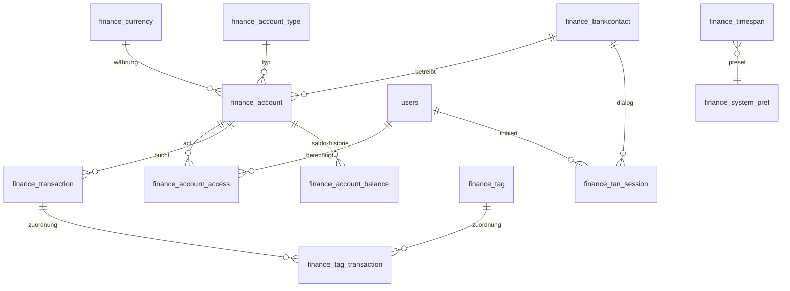

# Finance — Datenmodell & Migration

Ziel: Greenfield-Finanzmodul neben `photos` und `documents` in fk-encore.
Dieses Dokument legt Tabellen, Indizes, Constraints, die Initial-Migration
`0043_finance_initial.sql` und die neuen Permissions fest. Klassifikation
läuft ausschließlich über flache Tags (keine Kategorien, keine Rules).

Status: Feature-Plan, Umsetzung in Etappen.

---

## 1. Tabellenübersicht



Querbeziehungen ausgelassen: `finance_system_pref` ist reiner Key-Value-
Speicher ohne FK; `finance_timespan` dient nur als Preset-Nachschlag für
das Frontend.

---

## 2. Drizzle-Definitionen

Stil wie `db/schema.ts` — `pgTable`, `bigserial` für hochvolumige Tabellen,
`numeric(12,2)` für Geldbeträge, `timestamp({ mode: "string" })`, `pgEnum`,
`jsonb().$type<…>()` für getypte JSON-Spalten, Join-Tables mit
`primaryKey({ columns: [...] })`.

### 2.1 Enums

```ts
export const financeAccountLevelEnum = pgEnum("finance_account_level", [
  "read",
  "write",
]);

export const financeTagSourceEnum = pgEnum("finance_tag_source", [
  "user",
  "ai",
]);

export const financeAccountKindEnum = pgEnum("finance_account_kind", [
  "giro",
  "tagesgeld",
  "festgeld",
  "kredit",
  "depot",
  "bausparen",
  "kreditkarte",
  "sonstige",
]);
```

### 2.2 Stammdaten

```ts
export const financeCurrency = pgTable("finance_currency", {
  code: text("code").primaryKey(), // z. B. "EUR", "USD" (ISO 4217)
  symbol: text("symbol").notNull(),
  decimals: integer("decimals").notNull().default(2),
});

export const financeAccountType = pgTable("finance_account_type", {
  id: serial("id").primaryKey(),
  kind: financeAccountKindEnum("kind").notNull().unique(),
  label: text("label").notNull(),
});

export const financeTimespan = pgTable("finance_timespan", {
  id: serial("id").primaryKey(),
  slug: text("slug").unique().notNull(), // z. B. "current-month", "last-year"
  label: text("label").notNull(),
  offset_days: integer("offset_days"),
  offset_months: integer("offset_months"),
});
```

### 2.3 Bankkontakte und Konten

```ts
export interface FinanceSyncSlot {
  weekdays: number[]; // 0 = Sonntag … 6 = Samstag
  time: string;       // "HH:MM"
  tz: string;         // IANA-Zone, z. B. "Europe/Berlin"
}

export const financeBankcontact = pgTable("finance_bankcontact", {
  id: serial("id").primaryKey(),
  name: text("name").notNull(),
  blz: text("blz").notNull(),
  login: text("login").notNull(),
  server_url: text("server_url").notNull(),
  tan_method: text("tan_method"),
  credentials_encrypted: text("credentials_encrypted"), // AES-GCM-Blob
  sync_times: jsonb("sync_times").notNull()
    .default(sql`'[]'::jsonb`)
    .$type<FinanceSyncSlot[]>(),
  last_sync_at: timestamp("last_sync_at", { mode: "string" }),
  last_sync_status: text("last_sync_status"),
  created_at: timestamp("created_at", { mode: "string" }).defaultNow(),
});

export const financeAccount = pgTable("finance_account", {
  id: serial("id").primaryKey(),
  bankcontact_id: integer("bankcontact_id")
    .notNull()
    .references(() => financeBankcontact.id, { onDelete: "restrict" }),
  type_id: integer("type_id")
    .notNull()
    .references(() => financeAccountType.id, { onDelete: "restrict" }),
  currency_code: text("currency_code")
    .notNull()
    .references(() => financeCurrency.code, { onDelete: "restrict" }),
  iban: text("iban").unique(),
  account_number: text("account_number").notNull(),
  label: text("label").notNull(),
  active: boolean("active").notNull().default(true),
  created_at: timestamp("created_at", { mode: "string" }).defaultNow(),
});
```

### 2.4 Konto-ACL

```ts
export const financeAccountAccess = pgTable(
  "finance_account_access",
  {
    account_id: integer("account_id")
      .notNull()
      .references(() => financeAccount.id, { onDelete: "cascade" }),
    user_id: integer("user_id")
      .notNull()
      .references(() => users.id, { onDelete: "cascade" }),
    level: financeAccountLevelEnum("level").notNull(),
    created_at: timestamp("created_at", { mode: "string" }).defaultNow(),
  },
  (table) => [primaryKey({ columns: [table.account_id, table.user_id] })]
);
```

Ersetzt die beiden Finanzkraft-Rollen `Fk_AccountReader` und
`Fk_AccountWriter`. Das Level ist eine Tabellen-Spalte, keine Rolle —
so bleibt die fk-encore-Rollenmatrix unberührt.

### 2.5 Transaktionen und Salden

```ts
export const financeTransaction = pgTable("finance_transaction", {
  id: bigserial("id", { mode: "number" }).primaryKey(),
  account_id: integer("account_id")
    .notNull()
    .references(() => financeAccount.id, { onDelete: "restrict" }),
  booking_date: timestamp("booking_date", { mode: "string" }).notNull(),
  value_date: timestamp("value_date", { mode: "string" }),
  amount: numeric("amount", { precision: 12, scale: 2 }).notNull(),
  currency_code: text("currency_code")
    .notNull()
    .references(() => financeCurrency.code, { onDelete: "restrict" }),
  purpose: text("purpose"),
  counterparty: text("counterparty"),
  counterparty_iban: text("counterparty_iban"),
  fints_id: text("fints_id"), // stabile FinTS-Transaktions-ID (wenn vorhanden)
  dedupe_hash: text("dedupe_hash").notNull(), // siehe §3
  raw: jsonb("raw").$type<Record<string, unknown>>(),
  created_at: timestamp("created_at", { mode: "string" }).defaultNow(),
});

export const financeAccountBalance = pgTable(
  "finance_account_balance",
  {
    account_id: integer("account_id")
      .notNull()
      .references(() => financeAccount.id, { onDelete: "cascade" }),
    as_of: timestamp("as_of", { mode: "string" }).notNull(),
    balance: numeric("balance", { precision: 14, scale: 2 }).notNull(),
    source: text("source").notNull(), // "fints" | "manual" | "import"
  },
  (table) => [primaryKey({ columns: [table.account_id, table.as_of] })]
);
```

Bewusst keine eigene Status-Tabelle — Status wird bei Bedarf später als
`pgEnum`-Spalte nachgezogen. Beim Finanzkraft-Import wird der historische
Status nicht migriert (siehe `finance-data-import.md`).

### 2.6 Tags

```ts
export const financeTag = pgTable(
  "finance_tag",
  {
    id: serial("id").primaryKey(),
    name: text("name").notNull(),
    source: financeTagSourceEnum("source").notNull().default("user"),
    created_at: timestamp("created_at", { mode: "string" }).defaultNow(),
  },
  (table) => [
    // Gleicher Tag-Name kann als user- und als ai-Variante existieren,
    // damit AI-Vorschläge User-Tags nicht überschreiben.
    uniqueIndex("finance_tag_name_source_unique").on(table.name, table.source),
  ]
);

export const financeTagTransaction = pgTable(
  "finance_tag_transaction",
  {
    tag_id: integer("tag_id")
      .notNull()
      .references(() => financeTag.id, { onDelete: "cascade" }),
    transaction_id: integer("transaction_id")
      .notNull()
      .references(() => financeTransaction.id, { onDelete: "cascade" }),
    confidence: numeric("confidence", { precision: 4, scale: 3 }), // nur bei source='ai'
    created_at: timestamp("created_at", { mode: "string" }).defaultNow(),
  },
  (table) => [
    primaryKey({ columns: [table.tag_id, table.transaction_id] }),
  ]
);
```

### 2.7 TAN-Sessions und System-Preferences

```ts
export const financeTanSession = pgTable("finance_tan_session", {
  tan_reference: uuid("tan_reference").primaryKey(),
  user_id: integer("user_id")
    .notNull()
    .references(() => users.id, { onDelete: "cascade" }),
  bankcontact_id: integer("bankcontact_id")
    .notNull()
    .references(() => financeBankcontact.id, { onDelete: "cascade" }),
  banking_information: jsonb("banking_information")
    .notNull()
    .$type<Record<string, unknown>>(), // lib-fints-State
  challenge: text("challenge").notNull(),
  expires_at: timestamp("expires_at", { mode: "string" }).notNull(),
  created_at: timestamp("created_at", { mode: "string" }).defaultNow(),
});

export const financeSystemPref = pgTable("finance_system_pref", {
  key: text("key").primaryKey(),
  value: jsonb("value").notNull().$type<unknown>(),
  updated_at: timestamp("updated_at", { mode: "string" }).defaultNow(),
});
```

---

## 3. Indizes & Duplikaterkennung

| Tabelle | Index | Zweck |
|---|---|---|
| `finance_account` | `(bankcontact_id)` | FK-Lookup |
| `finance_account` | `unique(iban)` | Eindeutigkeit |
| `finance_transaction` | `(account_id, booking_date desc)` | Listen-Query |
| `finance_transaction` | `unique(account_id, dedupe_hash)` | Duplikat-Schutz |
| `finance_transaction` | `(fints_id)` where `fints_id is not null` | Re-Import |
| `finance_tag_transaction` | `(transaction_id)` | Umkehrrichtung |
| `finance_tan_session` | `(expires_at)` | Cleanup-Cron |
| `finance_account_balance` | `(account_id, as_of desc)` | Saldo-Verlauf |

`dedupe_hash` = SHA-256 über `booking_date | value_date | amount |
currency | purpose | counterparty_iban`. Liefert FinTS eine stabile
`fints_id`, wird diese bevorzugt zur Duplikatprüfung genutzt; `dedupe_hash`
bleibt als Fallback für Import und manuelle Buchungen.

---

## 4. Migration `0043_finance_initial.sql`

Nummer `0043`, weil `0042_feed_item_album_left.sql` bereits vergeben ist.
Die SQL wird über Drizzle generiert (`drizzle-kit generate`); diese Skizze
beschreibt den erwarteten Inhalt.

```sql
-- 0043_finance_initial.sql

CREATE TYPE finance_account_level AS ENUM ('read', 'write');
CREATE TYPE finance_tag_source AS ENUM ('user', 'ai');
CREATE TYPE finance_account_kind AS ENUM (
  'giro','tagesgeld','festgeld','kredit','depot','bausparen',
  'kreditkarte','bargeld','sonstige'
);

CREATE TABLE finance_currency (
  code     TEXT PRIMARY KEY,
  symbol   TEXT NOT NULL,
  decimals INTEGER NOT NULL DEFAULT 2
);

CREATE TABLE finance_account_type (
  id    SERIAL PRIMARY KEY,
  kind  finance_account_kind NOT NULL UNIQUE,
  label TEXT NOT NULL
);

CREATE TABLE finance_timespan (
  id            SERIAL PRIMARY KEY,
  slug          TEXT UNIQUE NOT NULL,
  label         TEXT NOT NULL,
  offset_days   INTEGER,
  offset_months INTEGER
);

CREATE TABLE finance_bankcontact (
  id                    SERIAL PRIMARY KEY,
  name                  TEXT NOT NULL,
  blz                   TEXT NOT NULL,
  login                 TEXT NOT NULL,
  server_url            TEXT NOT NULL,
  tan_method            TEXT,
  credentials_encrypted TEXT,
  sync_times            JSONB NOT NULL DEFAULT '[]'::jsonb,
  last_sync_at          TIMESTAMP,
  last_sync_status      TEXT,
  created_at            TIMESTAMP DEFAULT now()
);

CREATE TABLE finance_account (
  id             SERIAL PRIMARY KEY,
  bankcontact_id INTEGER NOT NULL REFERENCES finance_bankcontact(id)
                   ON DELETE RESTRICT,
  type_id        INTEGER NOT NULL REFERENCES finance_account_type(id)
                   ON DELETE RESTRICT,
  currency_code  TEXT NOT NULL REFERENCES finance_currency(code)
                   ON DELETE RESTRICT,
  iban           TEXT UNIQUE,
  account_number TEXT NOT NULL,
  label          TEXT NOT NULL,
  active         BOOLEAN NOT NULL DEFAULT TRUE,
  created_at     TIMESTAMP DEFAULT now()
);

CREATE TABLE finance_account_access (
  account_id INTEGER NOT NULL REFERENCES finance_account(id) ON DELETE CASCADE,
  user_id    INTEGER NOT NULL REFERENCES users(id)           ON DELETE CASCADE,
  level      finance_account_level NOT NULL,
  created_at TIMESTAMP DEFAULT now(),
  PRIMARY KEY (account_id, user_id),
  CONSTRAINT finance_account_access_level_chk
    CHECK (level IN ('read','write'))
);

CREATE TABLE finance_transaction (
  id                BIGSERIAL PRIMARY KEY,
  account_id        INTEGER NOT NULL REFERENCES finance_account(id)
                      ON DELETE RESTRICT,
  booking_date      TIMESTAMP NOT NULL,
  value_date        TIMESTAMP,
  amount            NUMERIC(12,2) NOT NULL,
  currency_code     TEXT NOT NULL REFERENCES finance_currency(code)
                      ON DELETE RESTRICT,
  purpose           TEXT,
  counterparty      TEXT,
  counterparty_iban TEXT,
  fints_id          TEXT,
  dedupe_hash       TEXT NOT NULL,
  raw               JSONB,
  created_at        TIMESTAMP DEFAULT now(),
  CONSTRAINT finance_transaction_dedupe_unique
    UNIQUE (account_id, dedupe_hash)
);

CREATE INDEX finance_transaction_account_booking_idx
  ON finance_transaction (account_id, booking_date DESC);

CREATE INDEX finance_transaction_fints_id_idx
  ON finance_transaction (fints_id)
  WHERE fints_id IS NOT NULL;

CREATE TABLE finance_tag (
  id         SERIAL PRIMARY KEY,
  name       TEXT NOT NULL,
  source     finance_tag_source NOT NULL DEFAULT 'user',
  created_at TIMESTAMP DEFAULT now(),
  CONSTRAINT finance_tag_name_source_unique UNIQUE (name, source)
);

CREATE TABLE finance_tag_transaction (
  tag_id         INTEGER NOT NULL REFERENCES finance_tag(id) ON DELETE CASCADE,
  transaction_id INTEGER NOT NULL REFERENCES finance_transaction(id)
                   ON DELETE CASCADE,
  confidence     NUMERIC(4,3),
  created_at     TIMESTAMP DEFAULT now(),
  PRIMARY KEY (tag_id, transaction_id)
);

CREATE INDEX finance_tag_transaction_transaction_idx
  ON finance_tag_transaction (transaction_id);

CREATE TABLE finance_account_balance (
  account_id INTEGER NOT NULL REFERENCES finance_account(id) ON DELETE CASCADE,
  as_of      TIMESTAMP NOT NULL,
  balance    NUMERIC(14,2) NOT NULL,
  source     TEXT NOT NULL,
  PRIMARY KEY (account_id, as_of)
);

CREATE TABLE finance_tan_session (
  tan_reference       UUID PRIMARY KEY,
  user_id             INTEGER NOT NULL REFERENCES users(id) ON DELETE CASCADE,
  bankcontact_id      INTEGER NOT NULL REFERENCES finance_bankcontact(id)
                        ON DELETE CASCADE,
  banking_information JSONB NOT NULL,
  challenge           TEXT NOT NULL,
  expires_at          TIMESTAMP NOT NULL,
  created_at          TIMESTAMP DEFAULT now()
);

CREATE INDEX finance_tan_session_expires_idx
  ON finance_tan_session (expires_at);

CREATE TABLE finance_system_pref (
  key        TEXT PRIMARY KEY,
  value      JSONB NOT NULL,
  updated_at TIMESTAMP DEFAULT now()
);

-- Seeds
INSERT INTO finance_currency (code, symbol, decimals) VALUES
  ('EUR','€',2),
  ('USD','$',2);

INSERT INTO finance_account_type (kind, label) VALUES
  ('giro','Girokonto'),
  ('tagesgeld','Tagesgeld'),
  ('festgeld','Festgeld'),
  ('kredit','Kreditkonto'),
  ('depot','Depot'),
  ('bausparen','Bausparvertrag'),
  ('kreditkarte','Kreditkarte'),
  ('sonstige','Sonstiges Konto');

INSERT INTO finance_timespan (slug, label, offset_days, offset_months) VALUES
  ('current-month','Aktueller Monat',NULL,0),
  ('last-month','Letzter Monat',NULL,-1),
  ('current-year','Aktuelles Jahr',NULL,NULL),
  ('last-year','Letztes Jahr',NULL,-12),
  ('last-30-days','Letzte 30 Tage',-30,NULL),
  ('last-90-days','Letzte 90 Tage',-90,NULL);
```

---

## 5. Permissions & Seed-Erweiterung

Vier neue Keys — analog zum Muster in `db/seed.ts:38-90` (siehe
`module.photos` / `module.documents`):

| Key | Zweck |
|---|---|
| `module.finance` | Modul-Toggle (Navigation, Dashboard-Kachel) |
| `finance.view` | Konten und Transaktionen sehen (ACL-gefiltert) |
| `finance.accounts.manage` | Bankkontakte / Konten anlegen, TAN-Flow auslösen |
| `finance.admin` | ACL-Bypass, Admin-Import, Systempreferences |

`finance.admin` gehört in das `adminExcludedPermissions`-Set (analog zu
`photos.purge`), damit selbst Nutzer mit `roles.admin` den Key nur explizit
vergeben bekommen und das nicht automatisch erben.

```ts
// db/seed.ts (ergänzen)
await upsertPermission(db, "module.finance", "Finanzmodul aktivieren");
await upsertPermission(db, "finance.view", "Konten & Transaktionen sehen");
await upsertPermission(
  db,
  "finance.accounts.manage",
  "Bankkontakte & Konten verwalten"
);
await upsertPermission(db, "finance.admin", "Finanz-Admin (ACL-Bypass, Import)");

adminExcludedPermissions.add("finance.admin");
```

In Handlern gilt konsequent das Pattern aus `user/auth-handler.ts:30-35`:

```ts
const authData = getAuthData()!;
await requirePermission(authData, "finance.view");
```

Konto-bezogene Endpoints (Liste, Detail, Transaktionen) filtern zusätzlich
über `finance_account_access`:

```sql
WHERE a.id IN (
  SELECT account_id FROM finance_account_access
  WHERE user_id = :userId
)
-- oder Bypass, falls der Caller 'finance.admin' hält.
```

---

## 6. Offene Punkte

- **Duplikaterkennung**: Ist `fints_id` für alle produktiv genutzten Banken
  stabil genug, dass wir sie als Primär-Kriterium nehmen? Ansonsten bleibt
  es beim kombinierten `dedupe_hash`. Erst nach Erfassung echter
  FinTS-Responses entscheidbar.
- **Retention für `finance_account_balance`**: Reicht ein Eintrag pro Tag,
  oder brauchen wir jede Saldo-Mitteilung? Impliziert Plattenplatz und
  Chart-Auflösung.
- **`raw`-Spalte**: Legen wir den vollständigen FinTS-Response in
  `finance_transaction.raw` ab, oder nur ausgewählte Felder? Rohdaten sind
  nützlich für Nach-Analysen, aber vergrößern die Tabelle deutlich.
