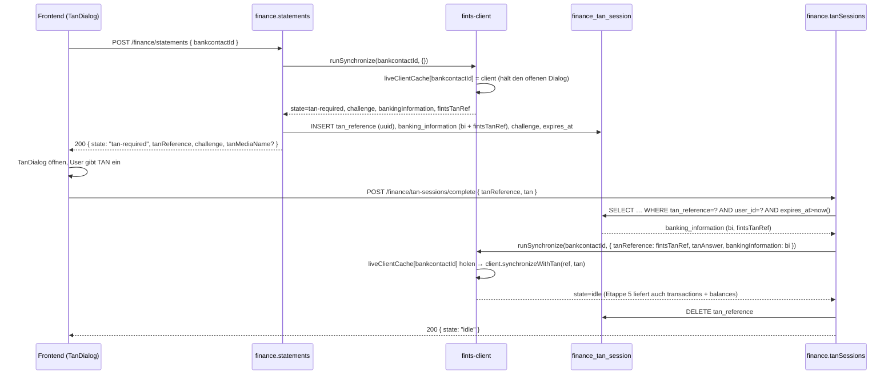
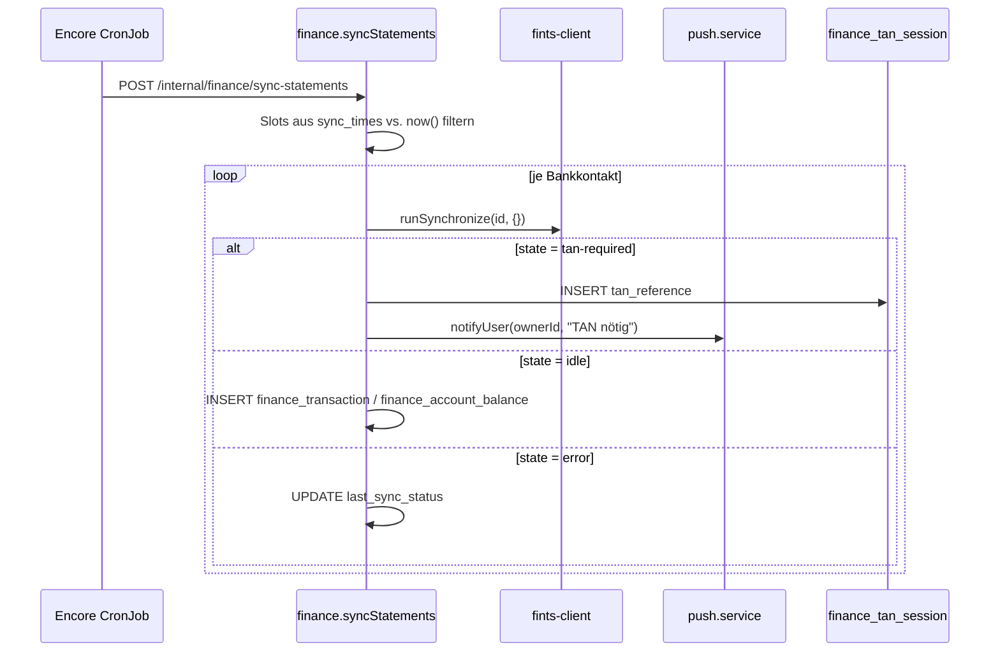

# Finance — FinTS-Integration, Credential-Verschlüsselung, TAN-Flow, Sync-Cron

Ziel: direkte Anbindung an deutsche Bank-APIs via FinTS (kein PSD2-
Aggregator), mit persistenten TAN-Sessions, verschlüsselter Credential-
Speicherung und periodischem Abruf neuer Umsätze.

Status: Feature-Plan, Umsetzung in Etappen.

---

## 1. Bibliotheks-Strategie: `lib-fints` via npm

Wir nutzen das npm-Paket `lib-fints`, nicht die Legacy-Finanzkraft-
Eigenimplementierung (`dbMixinOnlineBanking.js`).

- **Abhängigkeit**: `"lib-fints": "^<current>"` in `package.json`.
- **Bugfixes**: primär als **Upstream-PR**. Fork nur als Plan B, falls
  Upstream nicht zeitnah mergt. Damit bleibt unsere `package.json`
  semver-sauber und Updates problemlos.

---

## 2. `finance/fints-client.ts`

Dünner Wrapper über `lib-fints`, der das Dialog-Management kapselt und
den für uns relevanten Teil-Status exponiert.

### 2.1 State-Enum

Abgeleitet aus den Boolean-Flags der lib-fints-`ClientResponse`
(`success`, `requiresTan`). Der Wrapper exponiert die abgeleitete
Repräsentation — kein `"dialog"`-Zwischenstate mehr, weil lib-fints
uns diesen nicht mitteilt:

```ts
export type FintsDialogState =
  | "idle"           // Dialog sauber beendet, Daten verfügbar
  | "tan-required"   // wartet auf User-TAN oder decoupled Approval
  | "error";         // Transport oder FinTS-Antwort fehlgeschlagen
```

### 2.2 Schnittstelle (Auszug)

```ts
export interface DialogResult {
  state: FintsDialogState;
  // Set when state = "tan-required":
  tanChallenge?: string;
  tanReference?: string;
  tanMediaName?: string;
  // Set when state = "tan-required" oder "idle":
  bankingInformation?: Record<string, unknown>;
  // Set when state = "error":
  errorCode?: string;
  errorMessage?: string;
}

export async function runSynchronize(
  bankcontactId: number,
  opts?: {
    tanReference?: string;
    tanAnswer?: string;
    bankingInformation?: Record<string, unknown>;
  },
): Promise<DialogResult>;
```

Die Implementierung ist kein 1:1-Port des Legacy-`runSynchronize`.
Wir ersetzen das In-Memory-Singleton durch einen stateless Wrapper,
der seinen kompletten State (Credentials via DB-Lookup, Banking-Info
via Funktions-Parameter) auf jeden Call neu auflädt. Für Etappe 2
deckt `runSynchronize` nur das `synchronize` / `synchronizeWithTan`-
Paar ab; `getAccountStatements` + `…WithTan` folgen in Etappe 3 als
eigene Funktion.

### 2.3 Fehler- und Retry-Strategie

| FinTS-Code | Bedeutung | Reaktion |
|---|---|---|
| 9010 / 9050 | Allgemeiner Fehler | State `error`, kein Retry |
| 9910 | PIN/TAN falsch | State `error`, **kein** automatischer Retry; User muss Credentials neu setzen |
| Timeout | Netzwerk / Bankserver | bis zu 2 Retries mit 2s/4s Backoff |
| TAN-Methode nicht unterstützt | lib-fints-spezifisch | State `error`, Hinweis im Detail |

TAN-Methoden-Auswahl: beim ersten Dialog werden die verfügbaren Verfahren
aus der Bankantwort gelesen. Der User wählt genau einmal im Frontend
(`BankcontactDetailView`); die Wahl landet in `finance_bankcontact.tan_method`.

### 2.4 Pflicht-Secrets: ZKA-Produkt-Registrierung

`lib-fints` setzt — per PSD2-Vorgabe der Deutschen Kreditwirtschaft —
eine Produkt-Registrierung voraus. Jeder FinTS-Aufruf braucht eine
`productId` + `productVersion`, die man [bei der ZKA
registriert](https://www.fints.org/de/hersteller/produktregistrierung)
und als Konfiguration mitgibt.

Beides lebt als Encore-Secret, nicht im Code:

| Secret | Zweck |
|---|---|
| `FinanceCredentialsKey` | 32 Byte base64, AES-256-GCM-Key (siehe §3) |
| `FinanceFintsProductId` | ZKA-registrierte Produkt-ID |
| `FinanceFintsProductVersion` | Semantische Version des Finance-Moduls |

Für lokale Entwicklung und CI reichen Dummy-Strings — echte Werte sind
nur für Production verpflichtend. Setup:

```bash
encore secret set --type local FinanceFintsProductId "dev-placeholder"
encore secret set --type local FinanceFintsProductVersion "0.0.1"
```

### 2.5 Portfolio-Abruf für Depot-Konten (HKWPD)

Neben Giro-/Tagesgeld-Konten (HKKAZ/HKSAL) unterstützt der Client den
Abruf von Wertpapier-Depots über das FinTS-Segment HKWPD/HIWPD.

#### Depot-Erkennung

`effectiveAccountKind()` in `fints-client.ts` erkennt Depot-Konten auf
zwei Wegen:

1. **Direkt**: `accountType === "SecuritiesAccount"` → wird sofort als
   `"depot"` gemappt.
2. **Fallback**: Meldet die Bank den Typ `Miscellaneous` (z. B.
   comdirect, 1822direkt), prüft die Funktion das Feld `subAccountId`
   auf die Strings `"depot"` oder `"wertpapier"` (case-insensitive).

#### Fetch-Routing

`fetchOneAccount()` routet Depot-Konten durch `fetchDepotPortfolio()`
anstatt den Standard-Pfad HKKAZ/HKSAL. Depots verwenden weder
`getAccountStatements` noch `getAccountBalance` — stattdessen wird
`getPortfolio()` (HKWPD/HIWPD) aufgerufen.

#### Geteilte Kontonummern und `patchGetBankAccountForDepot()`

Einige Banken (z. B. comdirect) melden Giro- und Depot-Konto mit
derselben `accountNumber`; nur die `subAccountId` unterscheidet sie.
Das Problem: `config.getBankAccount(accountNumber)` in lib-fints nutzt
intern `.find()` und liefert immer den ersten Treffer (meist das Giro).
Ohne Eingriff würden `canGetPortfolio` und `getPortfolio` deshalb den
Giro-Eintrag statt des Depots prüfen bzw. verwenden.

**Lösung**: `patchGetBankAccountForDepot()` monkey-patcht
`config.getBankAccount` auf der Client-Instanz, sodass für die geteilte
`accountNumber` bevorzugt der Depot-Eintrag (Abgleich über
`subAccountId`) zurückgegeben wird. Der Patch überlebt UPD-Rebuilds
während der Dialog-Initialisierung — lib-fints ersetzt in
`initDialogInteraction.js:167` zwar `config.bankingInformation.upd`,
aber nicht die gepatchte Methode. Nach Abschluss des Portfolio-Abrufs
wird der Patch wieder zurückgesetzt.

Ein früherer Ansatz (Umsortierung des `upd.bankAccounts`-Arrays) schlug
fehl, weil die Dialog-Initialisierung das UPD aus der Bankantwort neu
aufbaut und jede Umsortierung damit rückgängig macht.

#### Deduplizierung in `runFetchAccounts()`

`runFetchAccounts()` dedupliziert Bank-seitige Konten nach
`accountNumber:effectiveKind` statt nur nach `accountNumber`. Damit wird
ein Depot nicht als vermeintliches Duplikat des Giro-Kontos übersprungen,
wenn beide dieselbe Kontonummer tragen.

#### Persist-Matching (Zwei-Phasen-Zuordnung)

`persistFetchResult()` ordnet Abruf-Ergebnisse in zwei Phasen zu:

1. **Phase 1 — Exakter Match**: Abgleich auf
   `(bankcontact_id, fints_account_number, kind)`. Der gefundene
   DB-Account wird als "claimed" markiert.
2. **Phase 2 — Fallback**: Für nicht zugeordnete Snapshots wird der
   einzige noch nicht beanspruchte Kandidat mit derselben Kontonummer
   verwendet.

Dieses Verfahren verhindert, dass ein Depot-Snapshot versehentlich dem
DB-Eintrag des Giro-Kontos zugeordnet wird (und umgekehrt).

#### Holdings-Persistierung

Der `totalValue` des Portfolios wird als Saldo in
`finance_account_balance` geschrieben. Die einzelnen Positionen (ISIN,
WKN, Name, Stückzahl, Kurs, Wert) werden per Upsert in
`finance_account_holding` persistiert:

```sql
ON CONFLICT (account_id, as_of, COALESCE(isin, wkn, name)) DO UPDATE
```

---

## 3. `finance/encryption.ts` — Credential-Verschlüsselung

### 3.1 Verfahren

AES-256-GCM mit einem globalen Key aus Encore-Secret
`FinanceCredentialsKey`. Key ist 32 Bytes (base64). Der Blob enthält
`iv (12 B) | ciphertext | authTag (16 B)`, base64-codiert, und landet in
`finance_bankcontact.credentials_encrypted`.

### 3.2 Skizze

```ts
import { secret } from "encore.dev/config";
import { createCipheriv, createDecipheriv, randomBytes } from "node:crypto";

const financeCredentialsKey = secret("FinanceCredentialsKey");

function getKey(): Buffer {
  const b = Buffer.from(financeCredentialsKey(), "base64");
  if (b.length !== 32) {
    throw new Error("FinanceCredentialsKey must be 32 bytes (base64)");
  }
  return b;
}

export function encryptCredentials(plain: string): string {
  const iv = randomBytes(12);
  const cipher = createCipheriv("aes-256-gcm", getKey(), iv);
  const ct = Buffer.concat([cipher.update(plain, "utf8"), cipher.final()]);
  const tag = cipher.getAuthTag();
  return Buffer.concat([iv, ct, tag]).toString("base64");
}

export function decryptCredentials(blob: string): string {
  const raw = Buffer.from(blob, "base64");
  const iv = raw.subarray(0, 12);
  const tag = raw.subarray(raw.length - 16);
  const ct = raw.subarray(12, raw.length - 16);
  const decipher = createDecipheriv("aes-256-gcm", getKey(), iv);
  decipher.setAuthTag(tag);
  return Buffer.concat([decipher.update(ct), decipher.final()]).toString("utf8");
}
```

Die Secret-Nutzung folgt dem Muster aus `push/push.service.ts:23-27`.
Plaintext-Credentials werden niemals in der DB oder in Logs abgelegt.

### 3.3 Rotation

1. Neues 32-Byte-Secret in Encore setzen: `encore secret set --type
   production FinanceCredentialsKey <base64>`.
2. Re-Encrypt-Skript (`scripts/finance-reencrypt.ts`) liest alle
   `finance_bankcontact`-Zeilen, entschlüsselt mit **altem** Key (über
   temporäre Envvar) und verschlüsselt mit **neuem** Key.
3. Deploy.

Alternative Envelope-Encryption (Root-Key + pro-Kontakt-DEK in der Zeile)
steht als Erweiterung offen — MVP startet mit einem globalen Key.

---

## 4. Stateful TAN-Flow

Der Legacy-Stack hielt TAN-State in einem In-Memory-Singleton; das
funktioniert in einer skalierten Encore-App nicht. Stattdessen liegt der
State in `finance_tan_session` (siehe `finance-data-model.md` §2.7):
`tan_reference UUID`, `banking_information jsonb`, `challenge text`,
`expires_at timestamptz` (TTL 10 min).



**Der Live-Client ist Teil des States.** `lib-fints` hängt den offenen
Dialog an die Client-Instanz (`FinTSClient.currentDialog`);
`synchronizeWithTan()` setzt genau diesen Dialog fort. Ein aus der
persistierten `bankingInformation` neu gebauter Client hat kein
`currentDialog` und wirft

```
no customer dialog was started which can continue
```

Deshalb legt `runSynchronize` den Client **auch bei `tan-required`** in
den `liveClientCache` (TTL 30 min) und der Resume-Pfad nimmt ihn von
dort, statt einen neuen zu bauen. Die in `finance_tan_session`
gespeicherte `banking_information` bleibt trotzdem nützlich (Warm-Start
beim nächsten Sync), taugt aber prinzipiell nicht zum Fortsetzen eines
laufenden Dialogs.

Der Resume-Aufruf ist bewusst **nicht** retry-gewrappt: ein Dialog ist
entweder offen oder weg — Wiederholungen reparieren nichts und kosten
nur das Backoff-Budget (2s + 4s), was den Fehler in der UI um 6
Sekunden verzögert.

Edge Cases:
- **Live-Client weg** (Container-Neustart oder TTL-Ablauf zwischen
  Challenge und Eingabe): Die Bank-Sitzung ist damit ebenfalls
  beendet. `complete` liefert `state: "error"` mit
  `errorCode: "live-client-evicted"` und der Bitte, den Sync neu zu
  starten — statt eines nichtssagenden Transport-Fehlers.
- **Abgelaufene Session**: `complete` wirft `deadline_exceeded` (HTTP
  504); die Zeile bleibt liegen und wird vom Cleanup-Cron gelöscht.
  UI startet einen frischen Dialog.
- **Falsche TAN**: lib-fints liefert wieder `state: "tan-required"`
  mit neuem Challenge. Der Endpoint **hält die Session** (nur
  `banking_information` + `challenge` werden aktualisiert) und gibt
  `200 { state: "tan-required", tanReference (same!), challenge: new }`
  zurück, sodass die UI direkt weiterfragen kann. Der FinTS-Server
  limitiert selbst auf typisch 3 Versuche — danach erhält der Client
  `state: "error"` und die Session wird gelöscht.
- **Fremde Session**: gehört die Reference einem anderen User, wirft
  der Endpoint `not_found` (statt `forbidden`), damit Enumeration
  fremder Sessions nicht möglich ist.
- **User verwirft Dialog**: Session wird nicht aktiv gelöscht, läuft
  durch TTL ab; Cleanup siehe §5.
- **Zweite TAN direkt nach der ersten** (comdirect/photoTAN): Nach dem
  akzeptierten Init-TAN verlangt die Bank für die Umsatzabfrage selbst
  noch einmal SCA. `complete` reicht deshalb die `userId` an
  `fetchAndPersist` weiter, damit daraus eine Folge-Session mit
  `kind="statements"` entsteht und die UI direkt weiterfragt. Ohne die
  `userId` fiel diese Challenge unter den Tisch: die Antwort war
  `state: "idle"`, der Dialog schloss sich wie bei Erfolg — und der
  nächste Sync fing wieder bei derselben TAN an.
- **Terminaler Fehler**: `state: "error"` löscht die Session
  serverseitig. Die UI **schließt den Dialog nicht**, sondern zeigt
  `errorCode: errorMessage` an und bietet nur noch „Schließen" an —
  sonst ist eine abgelehnte TAN von einer erfolgreichen nicht zu
  unterscheiden. Backend-seitig wird jeder nicht-`idle`-Ausgang von
  `complete` geloggt (`[fints] resume sync … state=…`,
  `[finance.tan-sessions] … init-TAN rejected: …`); vorher war der
  einzige Hinweis ein HTTP 200 im Access-Log.

**Transport-Konvention**: Sowohl `POST /finance/statements` als auch
`POST /finance/tan-sessions/complete` liefern eine gemeinsame
discriminated-union-Response (`SyncApiResponse`) mit den Varianten
`idle` / `tan-required` / `error`. Bewusst **kein** HTTP 409 Conflict
— das würde den Encore-type-safe-Client-Generator zu einem Exception-
Pfad zwingen. Stattdessen switcht das Frontend auf `response.state`.

---

## 5. Cron-Jobs

Das Repo verwendet Encore-native `new CronJob(...)`-Deklarationen mit
einem privaten Internal-API-Endpoint (`expose: false`) — siehe
`documents/inbox-cron.ts:28-76`. Wir folgen exakt diesem Muster; **kein**
externer Scheduler.

### 5.1 Sync neuer Umsätze

```ts
// finance/statements-cron.ts
export const syncStatements = api(
  { expose: false, method: "POST", path: "/internal/finance/sync-statements" },
  async (): Promise<{ contacts: number; tanRequired: number }> => {
    // 1. Bankkontakte mit passendem Slot aus sync_times laden
    // 2. Für jeden: runSynchronize(...)
    // 3. Bei state=tan-required:
    //    - finance_tan_session schreiben
    //    - Push an owner-User: "TAN für Sparkasse XY benötigt"
    // 4. Bei state=idle: Transaktionen + Salden persistieren
    // 5. finance_bankcontact.last_sync_at / last_sync_status aktualisieren
  },
);

const _ = new CronJob("finance-sync-statements", {
  title: "Finance: sync bank statements",
  every: "5m", // triggert oft, Filter sitzt in sync_times
  endpoint: syncStatements,
});
```

Der Cron feuert alle 5 Minuten (oder kleinster gemeinsamer Teiler der
tatsächlich verwendeten Slots). `sync_times` je Bankkontakt ist
timezone-aware (`{ weekdays, time: "HH:MM", tz }`); der Handler rechnet
auf UTC um und entscheidet, ob dieser Tick den Slot trifft (±2 min
Toleranz). Damit funktioniert die DST-Umstellung korrekt, ohne doppelte
UTC-Spalte.



### 5.2 Inkrementeller Abruf — `from`-Fenster pro Konto

`getAccountStatements(accountNumber, from?)` lässt die Bank ab einem
Stichdatum bis heute liefern. Ohne `from` pickt jede Bank einen anderen,
oft uralten Default (comdirect z. B. liefert dann teils 3+ Jahre statt
neuer Buchungen). Wir setzen `from` deshalb pro Konto in
`fetchAndPersist`:

| Konto-Status | `from` |
|---|---|
| Hat bereits Buchungen in `finance_transaction` | `MAX(booking_date) − 14 Tage` |
| Frisch verlinktes Konto, noch keine Daten | `now() − 89 Tage` |

Die 14-Tage-Überlappung fängt Spät-Buchungen und Nachträge auf;
Duplikate werden über den Unique-Index `dedupe_hash` (siehe
`finance-data-model.md` §3) ohne Datenbank-Konflikt verworfen. Die
Erstabfrage liegt mit 89 Tagen bewusst *innerhalb* des
PSD2-Read-Only-Fensters (ein Datum exakt auf der 90-Tage-Grenze werten
manche Banken schon als „älter als 90 Tage" und verlangen dann bei
jedem Sync eine frische TAN) und löst deshalb keine zusätzliche SCA aus — wer mehr Historie braucht,
muss entweder den Finanzkraft-Import nutzen
(`finance-data-import.md`) oder den Default-Wert in `statements.ts`
temporär hochsetzen und die einmalige TAN-Aufforderung in Kauf nehmen.

`to` lassen wir leer; die Bank liefert dann bis zum aktuellen Tag.

```ts
// finance/statements.ts (Auszug)
const fromByAccountNumber = new Map<string, Date>();
const overlapMs = 14 * 24 * 60 * 60_000;
for (const m of maxes) {
  fromByAccountNumber.set(
    row.fints_account_number,
    new Date(new Date(m.latest).getTime() - overlapMs),
  );
}
const defaultFrom = new Date(Date.now() - 89 * 24 * 60 * 60_000);

await runFetchAccounts(client, {
  linkedAccountNumbers,
  fromByAccountNumber,
  defaultFrom,
});
```

`runFetchAccounts` (`finance/fints-client.ts`) ruft pro Konto den
passenden Wert ab; nicht-verlinkte Bank-Konten werden komplett
übersprungen, damit jede TAN nur einmal angefordert wird (siehe §5.3
unten).

Der Plan (verlinkte Konten + `from`-Map + `defaultFrom`) steckt in
`statements.buildFetchPlan()` und wird **auch beim TAN-Resume** benutzt
(`tan-sessions.resumeStatementsTan` → `resumeFetchAfterTan`). Vorher lief
die Warteschlange hinter dem pausierten Konto ohne Plan weiter: ohne
`linkedAccountNumbers` mit SCA-Push für nicht verlinkte Konten, ohne
`from` außerhalb des 90-Tage-Fensters — also mit einer neuen
TAN-Challenge für praktisch jedes Folgekonto.

### 5.3 Nur verlinkte Konten abrufen

Bevor `runFetchAccounts` ein Bank-Konto öffnet, prüft es
`linkedAccountNumbers`. Steht das Konto nicht drin (z. B. weil der User
es bewusst nicht in fk-encore verlinkt hat), überspringt der Loop
sowohl `getAccountStatements` als auch `getAccountBalance`. Resultat:

- Keine SCA-Push-Aufforderung für Konten, an denen wir gar nicht
  interessiert sind.
- Keine doppelten TAN-Eingaben, wenn die Bank pro Konto-Block neu
  fragt.
- Bank-Konten, die noch nie in fk-encore verlinkt wurden, tauchen in
  der `pendingAccounts`-Antwort auf, damit das Frontend sie zur
  Verlinkung anbieten kann (siehe `finance-frontend.md` §4.3).

### 5.4 Cleanup abgelaufener TAN-Sessions

```ts
export const cleanupTanSessions = api(
  { expose: false, method: "POST",
    path: "/internal/finance/tan-sessions/cleanup" },
  async (): Promise<{ deleted: number }> => {
    // DELETE FROM finance_tan_session WHERE expires_at < now()
  },
);

const _ = new CronJob("finance-tan-cleanup", {
  title: "Finance: cleanup expired TAN sessions",
  every: "1h",
  endpoint: cleanupTanSessions,
});
```

---

## 6. Referenzen

| Stelle im Repo | Wofür |
|---|---|
| `documents/inbox-cron.ts:28-76` | Cron-Pattern (`new CronJob` + privater Internal-Endpoint) |
| `push/push.service.ts:23-27` | `secret()`-Nutzung für Verschlüsselungs-Keys |
| `user/auth-handler.ts:30-35` | `requirePermission("finance.accounts.manage")` in Handlern |
| `finance-data-model.md` §2.7 | Schema `finance_tan_session` |
| `finance-data-model.md` §2.3 | `finance_bankcontact.sync_times` |

---

## 7. Offene Punkte

- **Key-Rotation**: globaler Key (MVP) vs. Envelope-Encryption (pro-
  Kontakt-DEK)? Letzteres wäre nach einem kompromittierten Dump leichter
  zu mitigieren, fügt aber eine Indirektion hinzu.
- **Retry-Budget im Sync-Cron**: nach wie vielen aufeinanderfolgenden
  Fehl-Syncs schalten wir einen Bankkontakt automatisch auf „paused"?
- **TAN-Push-Spam**: wenn ein Cron wiederholt `tan-required` meldet und
  der User nicht reagiert — Rate-Limit pro Bankkontakt?
