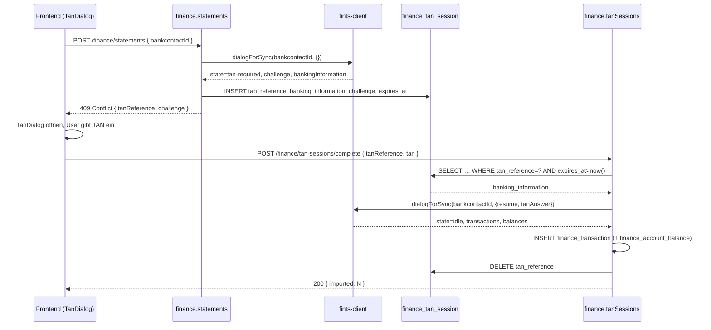

# Finance — FinTS-Integration, Credential-Verschlüsselung, TAN-Flow, Sync-Cron

Ziel: direkte Anbindung an deutsche Bank-APIs via FinTS (kein PSD2-
Aggregator), mit persistenten TAN-Sessions, verschlüsselter Credential-
Speicherung und periodischem Abruf neuer Umsätze.

Status: Feature-Plan, Umsetzung in Etappen.

---

## 1. Bibliotheks-Strategie: `lib-fints` via npm

Wir nutzen das npm-Paket `lib-fints`, nicht die Legacy-Finanzkraft-
Eigenimplementierung (`dbMixinOnlineBanking.js`).

- **Abhängigkeit**: `"lib-fints": "^<current>"` in `package.json`.
- **Bugfixes**: primär als **Upstream-PR**. Fork nur als Plan B, falls
  Upstream nicht zeitnah mergt. Damit bleibt unsere `package.json`
  semver-sauber und Updates problemlos.
- **Bekannter offener Punkt**: ING-Zugang liefert in bestimmten
  Konstellationen fehlerhafte HBCI-Dialog-Schritte. Reproduzierbar erst
  nach Erfassung echter Credentials eines ING-Nutzers. Fix-Sequenz:
  1. Reproduktion gegen Testzugang.
  2. Patch lokal im Service (Workaround, falls möglich) **und**
     Upstream-PR.
  3. Nach Merge: Workaround entfernen.

---

## 2. `finance/fints-client.ts`

Dünner Wrapper über `lib-fints`, der das Dialog-Management kapselt und
den für uns relevanten Teil-Status exponiert.

### 2.1 Status-Enum

```ts
export type FintsDialogState =
  | "idle"
  | "dialog"         // FinTS-Dialog offen
  | "tan-required"   // wartet auf User-TAN
  | "error";
```

### 2.2 Schnittstelle (Auszug)

```ts
export interface DialogResult {
  state: FintsDialogState;
  // Nur gesetzt bei state = "tan-required":
  tanChallenge?: string;
  // Roh-State der lib-fints-Session (landet in finance_tan_session):
  bankingInformation?: Record<string, unknown>;
  // Nur gesetzt bei state = "idle" (Dialog sauber beendet):
  transactions?: FintsTransaction[];
  balances?: FintsBalance[];
  // Nur bei state = "error":
  errorCode?: string;
  errorMessage?: string;
}

export async function dialogForSync(
  bankcontactId: number,
  opts: { tanAnswer?: string; resume?: Record<string, unknown> }
): Promise<DialogResult>;
```

Port-Vorlage: `dialogForSync` aus der Legacy-`dbMixinOnlineBanking.js`.
Kein 1:1-Port — wir ersetzen das In-Memory-Singleton durch stateless
Aufrufe, die ihren kompletten State aus `finance_tan_session` laden.

### 2.3 Fehler- und Retry-Strategie

| FinTS-Code | Bedeutung | Reaktion |
|---|---|---|
| 9010 / 9050 | Allgemeiner Fehler | State `error`, kein Retry |
| 9910 | PIN/TAN falsch | State `error`, **kein** automatischer Retry; User muss Credentials neu setzen |
| Timeout | Netzwerk / Bankserver | bis zu 2 Retries mit 2s/4s Backoff |
| TAN-Methode nicht unterstützt | lib-fints-spezifisch | State `error`, Hinweis im Detail |

TAN-Methoden-Auswahl: beim ersten Dialog werden die verfügbaren Verfahren
aus der Bankantwort gelesen. Der User wählt genau einmal im Frontend
(`BankcontactDetailView`); die Wahl landet in `finance_bankcontact.tan_method`.

---

## 3. `finance/encryption.ts` — Credential-Verschlüsselung

### 3.1 Verfahren

AES-256-GCM mit einem globalen Key aus Encore-Secret
`FinanceCredentialsKey`. Key ist 32 Bytes (base64). Der Blob enthält
`iv (12 B) | ciphertext | authTag (16 B)`, base64-codiert, und landet in
`finance_bankcontact.credentials_encrypted`.

### 3.2 Skizze

```ts
import { secret } from "encore.dev/config";
import { createCipheriv, createDecipheriv, randomBytes } from "node:crypto";

const financeCredentialsKey = secret("FinanceCredentialsKey");

function getKey(): Buffer {
  const b = Buffer.from(financeCredentialsKey(), "base64");
  if (b.length !== 32) {
    throw new Error("FinanceCredentialsKey must be 32 bytes (base64)");
  }
  return b;
}

export function encryptCredentials(plain: string): string {
  const iv = randomBytes(12);
  const cipher = createCipheriv("aes-256-gcm", getKey(), iv);
  const ct = Buffer.concat([cipher.update(plain, "utf8"), cipher.final()]);
  const tag = cipher.getAuthTag();
  return Buffer.concat([iv, ct, tag]).toString("base64");
}

export function decryptCredentials(blob: string): string {
  const raw = Buffer.from(blob, "base64");
  const iv = raw.subarray(0, 12);
  const tag = raw.subarray(raw.length - 16);
  const ct = raw.subarray(12, raw.length - 16);
  const decipher = createDecipheriv("aes-256-gcm", getKey(), iv);
  decipher.setAuthTag(tag);
  return Buffer.concat([decipher.update(ct), decipher.final()]).toString("utf8");
}
```

Die Secret-Nutzung folgt dem Muster aus `push/push.service.ts:23-27`.
Plaintext-Credentials werden niemals in der DB oder in Logs abgelegt.

### 3.3 Rotation

1. Neues 32-Byte-Secret in Encore setzen: `encore secret set --type
   production FinanceCredentialsKey <base64>`.
2. Re-Encrypt-Skript (`scripts/finance-reencrypt.ts`) liest alle
   `finance_bankcontact`-Zeilen, entschlüsselt mit **altem** Key (über
   temporäre Envvar) und verschlüsselt mit **neuem** Key.
3. Deploy.

Alternative Envelope-Encryption (Root-Key + pro-Kontakt-DEK in der Zeile)
steht als Erweiterung offen — MVP startet mit einem globalen Key.

---

## 4. Stateful TAN-Flow

Der Legacy-Stack hielt TAN-State in einem In-Memory-Singleton; das
funktioniert in einer skalierten Encore-App nicht. Stattdessen liegt der
State in `finance_tan_session` (siehe `finance-data-model.md` §2.7):
`tan_reference UUID`, `banking_information jsonb`, `challenge text`,
`expires_at timestamptz` (TTL 10 min).



Edge Cases:
- **Abgelaufene Session**: `complete` liefert `410 Gone`, UI startet
  neuen Dialog.
- **Falsche TAN**: `complete` liefert `401`, UI zeigt Retry-Option; bis
  zu 3 Versuche gegen dieselbe Session (vom FinTS-Server limitiert).
- **User verwirft Dialog**: Session wird nicht aktiv gelöscht, läuft
  durch TTL ab; Cleanup siehe §5.

---

## 5. Cron-Jobs

Das Repo verwendet Encore-native `new CronJob(...)`-Deklarationen mit
einem privaten Internal-API-Endpoint (`expose: false`) — siehe
`documents/inbox-cron.ts:28-76`. Wir folgen exakt diesem Muster; **kein**
externer Scheduler.

### 5.1 Sync neuer Umsätze

```ts
// finance/statements-cron.ts
export const syncStatements = api(
  { expose: false, method: "POST", path: "/internal/finance/sync-statements" },
  async (): Promise<{ contacts: number; tanRequired: number }> => {
    // 1. Bankkontakte mit passendem Slot aus sync_times laden
    // 2. Für jeden: dialogForSync(...)
    // 3. Bei state=tan-required:
    //    - finance_tan_session schreiben
    //    - Push an owner-User: "TAN für Sparkasse XY benötigt"
    // 4. Bei state=idle: Transaktionen + Salden persistieren
    // 5. finance_bankcontact.last_sync_at / last_sync_status aktualisieren
  },
);

const _ = new CronJob("finance-sync-statements", {
  title: "Finance: sync bank statements",
  every: "5m", // triggert oft, Filter sitzt in sync_times
  endpoint: syncStatements,
});
```

Der Cron feuert alle 5 Minuten (oder kleinster gemeinsamer Teiler der
tatsächlich verwendeten Slots). `sync_times` je Bankkontakt ist
timezone-aware (`{ weekdays, time: "HH:MM", tz }`); der Handler rechnet
auf UTC um und entscheidet, ob dieser Tick den Slot trifft (±2 min
Toleranz). Damit funktioniert die DST-Umstellung korrekt, ohne doppelte
UTC-Spalte.


### 5.2 Cleanup abgelaufener TAN-Sessions

```ts
export const cleanupTanSessions = api(
  { expose: false, method: "POST",
    path: "/internal/finance/tan-sessions/cleanup" },
  async (): Promise<{ deleted: number }> => {
    // DELETE FROM finance_tan_session WHERE expires_at < now()
  },
);

const _ = new CronJob("finance-tan-cleanup", {
  title: "Finance: cleanup expired TAN sessions",
  every: "1h",
  endpoint: cleanupTanSessions,
});
```

---

## 6. Referenzen

| Stelle im Repo | Wofür |
|---|---|
| `documents/inbox-cron.ts:28-76` | Cron-Pattern (`new CronJob` + privater Internal-Endpoint) |
| `push/push.service.ts:23-27` | `secret()`-Nutzung für Verschlüsselungs-Keys |
| `user/auth-handler.ts:30-35` | `requirePermission("finance.accounts.manage")` in Handlern |
| `finance-data-model.md` §2.7 | Schema `finance_tan_session` |
| `finance-data-model.md` §2.3 | `finance_bankcontact.sync_times` |

---

## 7. Offene Punkte

- **Key-Rotation**: globaler Key (MVP) vs. Envelope-Encryption (pro-
  Kontakt-DEK)? Letzteres wäre nach einem kompromittierten Dump leichter
  zu mitigieren, fügt aber eine Indirektion hinzu.
- **Retry-Budget im Sync-Cron**: nach wie vielen aufeinanderfolgenden
  Fehl-Syncs schalten wir einen Bankkontakt automatisch auf „paused"?
- **ING-Fix**: Reproduktion erst nach Credential-Erfassung; Tracking als
  eigenes Issue nach MVP.
- **TAN-Push-Spam**: wenn ein Cron wiederholt `tan-required` meldet und
  der User nicht reagiert — Rate-Limit pro Bankkontakt?
