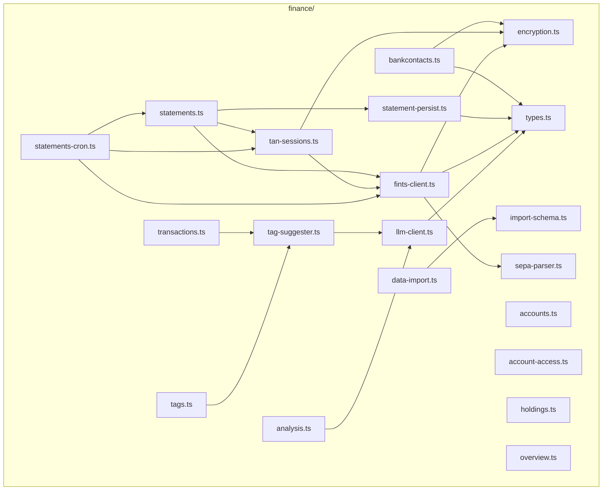

# Finance — Service-Datei-Layout

Ziel: Übersicht aller TypeScript-Dateien, die im neuen `finance/`-Ordner
entstehen, mit ihrer Verantwortung und ihren wichtigsten Importen. Folgt
dem Muster aus `documents/`: ein `encore.service.ts` als Boot-Datei,
darunter feature-orientierte Endpoint-Module, Tests collocated.

Status: Feature-Plan, Umsetzung in Etappen.

---

## 1. Verzeichnisbaum

```
finance/
├── encore.service.ts          # Service-Definition + Side-Effect-Imports
├── types.ts                   # geteilte TypeScript-Interfaces
├── encryption.ts              # AES-GCM-Credential-Crypto
├── encryption.test.ts
├── fints-client.ts            # lib-fints-Wrapper, runSynchronize, runFetchAccounts
├── fints-client.test.ts
├── llm-client.ts              # finance-spezifischer llm-service-Client
├── bankcontacts.ts            # CRUD + Credential-Set
├── bankcontacts.test.ts
├── accounts.ts                # CRUD, ACL-gefilterte Listen, Link/Unlink
├── accounts.test.ts
├── account-access.ts          # ACL-Verwaltung (finance.admin)
├── account-access.test.ts
├── statements.ts              # POST /finance/statements (Sync auslösen)
├── statements.test.ts
├── statement-persist.ts       # Persist-Logik für FetchResult → DB
├── statement-persist.test.ts
├── tan-sessions.ts            # POST /finance/tan-sessions/complete
├── tan-sessions.test.ts
├── transactions.ts            # Liste, Detail, manuelle Buchung
├── transactions.test.ts
├── holdings.ts                # GET /finance/accounts/:id/holdings (Depot)
├── overview.ts                # GET /finance/overview (Saldo-Übersicht)
├── overview.test.ts
├── tags.ts                    # Tag-CRUD + KI-Vorschläge bestätigen
├── tags.test.ts
├── analysis.ts                # Natural-Language-Query → AST + Aggregat
├── analysis.test.ts
├── statements-cron.ts         # CronJobs: sync + tan-cleanup
├── statements-cron.test.ts
├── sync-schedule.ts           # Sync-Zeiten-Verwaltung
├── sync-schedule.test.ts
├── data-import.ts             # POST /finance/admin/import
├── data-import.test.ts
├── tag-suggester.ts           # Embedding + classify, beim Insert genutzt
├── tag-suggester.test.ts
├── tag-queue.ts               # Tag-Suggestion-Queue (async)
├── tag-queue-api.ts           # Queue-Endpoint für manuellen Trigger
├── tag-queue-events.ts        # PubSub events for tag queue
├── tag-worker.ts              # Background worker für Tag-Suggestions
├── sepa-parser.ts             # SEPA-Verwendungszweck-Parser
├── sepa-parser.test.ts
├── rate-limiting.test.ts      # Rate-Limiting-Tests
├── import-schema.ts           # Zod-Schema für Finanzkraft-JSON
├── import-pending.ts          # Pending-Import-Verarbeitung
├── iso-btc-codes.ts           # ISO BTC-Code-Mapping
├── export-cron.ts             # Export/Backup-Cron
├── anomaly-detector.ts        # Anomalie-Erkennung in Transaktionen
```

31 Produktivdateien + 18 Test-Dateien.

---

## 2. `encore.service.ts` — Boot

Analog zu `documents/encore.service.ts`. Side-Effect-Imports für die
Cron-Registrierung; keine eigenen Watcher (anders als `documents`).

```ts
import { Service } from "encore.dev/service";

// Cron registrieren (sync + TAN-Cleanup). Das Modul exportiert die
// internen API-Endpoints und feuert oben `new CronJob(...)`.
import "./statements-cron";

export default new Service("finance");
```

---

## 3. Verantwortungs-Tabelle

| Datei | Zweck | Endpoints (Pfad / Methode) | Permission |
|---|---|---|---|
| `encryption.ts` | AES-256-GCM, `encryptCredentials` / `decryptCredentials` | — | (intern) |
| `fints-client.ts` | `runSynchronize(bankcontactId, opts)`; State-Enum + `clientFactory`/`sleep`-Test-Seams | — | (intern) |
| `llm-client.ts` | `embed(text)`, `suggestTags(...)`, `parseAnalysisQuery(...)` | — | (intern) |
| `bankcontacts.ts` | Bankkontakte CRUD, Credentials setzen | `GET/POST/PUT/DELETE /finance/bankcontacts[/:id]`, `POST /finance/bankcontacts/:id/credentials` | `finance.accounts.manage` |
| `accounts.ts` | Konten lesen/listen (ACL-gefiltert), inaktivieren | `GET /finance/accounts[/:id]`, `PATCH /finance/accounts/:id` | `finance.view` |
| `account-access.ts` | ACL-Zeilen anlegen/entfernen | `GET/PUT/DELETE /finance/admin/access/:accountId` | `finance.admin` |
| `statements.ts` | Sync auslösen, ggf. 409 mit `tanReference` | `POST /finance/statements` | `finance.accounts.manage` |
| `tan-sessions.ts` | TAN abschließen, Lifecycle | `POST /finance/tan-sessions/complete`, `DELETE /finance/tan-sessions/:ref` | `finance.accounts.manage` |
| `transactions.ts` | Liste/Detail, manuelle Buchung, Tag-Promotion | `GET /finance/transactions[/:id]`, `POST /finance/transactions`, `POST /finance/transactions/:id/tags/promote`, `POST /finance/transactions/batch-tag` | `finance.view` |
| `tags.ts` | Tag-Liste, Suggest-Batch | `GET /finance/tags`, `POST /finance/tags/suggest` | `finance.view` |
| `analysis.ts` | Frage → AST → Aggregat | `POST /finance/analysis/query`, `POST /finance/analysis/aggregate` | `finance.view` |
| `statements-cron.ts` | Cron: Sync + TAN-Cleanup | `POST /internal/finance/sync-statements`, `POST /internal/finance/tan-sessions/cleanup` | (intern, `expose: false`) |
| `data-import.ts` | Finanzkraft-JSON-Import | `POST /finance/admin/import` | `finance.admin` |
| `tag-suggester.ts` | Beim TX-Insert: embed + classify, Vorschläge persistieren | — | (intern) |
| `import-schema.ts` | Zod-Schema des Finanzkraft-JSON | — | (intern) |
| `types.ts` | gemeinsam genutzte Interfaces (`FinanceSyncSlot`, `DialogResult`, …) | — | — |
| `statement-persist.ts` | `persistFetchResult(bankcontactId, result)`: Schreibt Transaktionen, Salden und Holdings aus einem FetchResult in die DB. Zwei-Phasen-Matching (exact kind → unclaimed fallback). | — | (intern) |
| `holdings.ts` | Depot-Positionen abfragen | `GET /finance/accounts/:id/holdings` | `finance.view` |
| `overview.ts` | Konten-Übersicht mit Salden, Sektionen | `GET /finance/overview`, `PUT /finance/overview` | `finance.view` |
| `sepa-parser.ts` | SEPA-Verwendungszweck-Parser (EREF, KREF, MREF, CRED, …) | — | (intern) |
| `tag-queue.ts` | Asynchrone Tag-Suggestion-Queue | — | (intern) |
| `tag-worker.ts` | Background-Worker für Tag-Suggestions | — | (intern) |
| `anomaly-detector.ts` | Anomalie-Erkennung (ungewöhnliche Beträge, neue Gegenseiten) | — | (intern) |

Jeder Handler folgt dem Pattern aus `user/auth-handler.ts:30-35`:

```ts
const auth = getAuthData()!;
await requirePermission(auth, "finance.view");
```

Konto-bezogene Reads zusätzlich mit ACL-Filter (siehe
`finance-data-model.md` §5).

---

## 4. Import-Topologie

Nur die wichtigsten Abhängigkeiten — Drizzle / `db/database` / `users`
sind als gegeben weggelassen.



Beobachtungen:
- `encryption.ts` ist Single-Source-of-Truth für Crypto; sowohl Endpoint-
  Module als auch der FinTS-Client ziehen es ein.
- `fints-client.ts` ist der einzige Konsument von `lib-fints` — Tests
  mocken diesen Wrapper, nicht die Bibliothek direkt.
- `tag-suggester.ts` kapselt die KI-Pipeline aus
  `finance-tagging-and-ai.md` §3 und wird sowohl vom synchronen Insert
  in `transactions.ts` als auch vom Batch-Endpoint in `tags.ts` genutzt.
- Cron importiert die Endpoint-Funktionen aus `statements.ts` /
  `tan-sessions.ts` (Encore lässt CronJob direkt auf einen API-Endpoint
  zeigen).

---

## 5. Beziehung zu bestehenden Modulen

| Bestehend | Genutzt durch | Wofür |
|---|---|---|
| `db/database`, `db/schema` | alle Endpoint-Module | Drizzle-Zugriff |
| `db/seed.ts` | (Migration-Zeit) | neue Permissions registrieren |
| `user/auth-handler.ts` | jeder Handler | `requirePermission` |
| `push/push.service.ts` | `statements-cron.ts`, `tan-sessions.ts` | Push bei TAN-Bedarf |
| `llm-service/` (FastAPI) | `llm-client.ts` | `/embed`, `/classify` |

Keine Änderungen an bestehenden Modulen außer dem Seed-Patch in
`db/seed.ts` (siehe `finance-data-model.md` §5).

---

## 6. Konventionen

- **Datei-Namen**: kebab-case (`account-access.ts`), passend zu
  `documents/`.
- **Test-Datei-Namen**: collocated, `*.test.ts` (Vitest, siehe
  `finance-testing.md` — folgt als nächstes Dokument).
- **Boot-Logs**: `console.log("[boot] finance/<datei>: …")` analog zu
  `documents/`.
- **Keine Default-Exports** außer `encore.service.ts`.
- **Endpoint-Funktionen** als `export const xxx = api(...)` benannt nach
  ihrer Aktion (`listAccounts`, `getAccount`, `syncStatements` …).
- **Interne Endpoints** strikt unter `/internal/finance/*` mit
  `expose: false`.

---

## 7. Offene Punkte

- **Ein-Datei-Endpoints vs. Module**: passt es, dass Endpoints und ihre
  Helper in derselben Datei liegen, oder splitten wir Endpoints (`*.ts`)
  und Logik (`*-ops.ts`) wie in `documents/document-ops.ts`? Tendenz:
  beim documents-Stil bleiben, also splitten, sobald eine Datei > 400
  Zeilen wird.
- **Geteilter `db.ts`**: Brauchen wir `finance/db.ts` für wiederkehrende
  Queries (z. B. ACL-Filter), oder bleibt das in den Endpoint-Modulen?
  Empfehlung: erst extrahieren, sobald derselbe SQL-Block 3× vorkommt.
- **`tag-suggester.ts` synchron oder Queue**: bisher als synchroner Best-
  Effort beim Insert eingeplant; bei Massen-Imports ggf. Queue-basiert.
  Architektur-Entscheidung gehört zu `finance-tagging-and-ai.md` §7.
