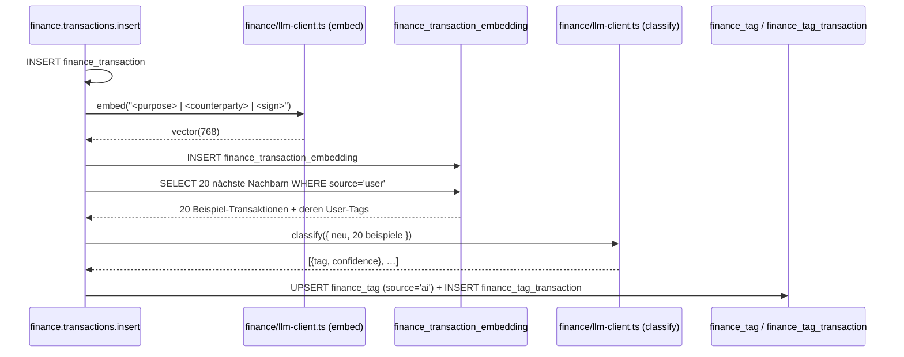

# Finance — Flache Tags und KI-Tagging

Ziel: Transaktionen werden nicht über Kategorien oder Rules klassifiziert,
sondern über **flache, mehrfach zuweisbare Tags**. Neue Transaktionen
bekommen beim Insert automatisch KI-Vorschläge vom `llm-service`; der User
bestätigt oder verwirft. Analyse-Abfragen nutzen Freitextfragen, die in
Tag-Filter übersetzt werden.

Status: Feature-Plan, Umsetzung in Etappen.

---

## 1. Designentscheidung: flache Tags statt Hierarchie

Das Legacy-Finanzkraft kannte eine hierarchische Kategorie-Baumstruktur
plus Regel-Engine. Beides wird **nicht** portiert. Begründung:

- **Ein Buchungsvorgang gehört fast immer zu mehreren Clustern
  gleichzeitig** — ein Restaurantbesuch in Florenz ist zugleich
  `urlaub`, `italien-2024`, `restaurant`, und er lässt sich nicht
  widerspruchsfrei in einem einzigen Baum unterbringen.
- **Flexibles Querschneiden**: Summen lassen sich über beliebige Tag-
  Kombinationen aggregieren, statt nur entlang einer Hierarchie.
- **Weniger Pflegeaufwand**: keine Regel-Engine, die nachträglich wieder
  angepasst werden muss, wenn sich ein Geschäft umbenennt oder ein neuer
  Vertragspartner hinzukommt.

Beispiel-Cluster, die sich damit sauber abbilden lassen:

| Cluster | Tag-Set |
|---|---|
| „Ausgaben Italien-Urlaub 2024" | `urlaub` + `italien-2024` |
| „Altersvorsorge, jährliche Einzahlungen" | `altersvorsorge` + `jährlich` |
| „Instandhaltung Immobilie X" | `immobilie-x` + `instandhaltung` |
| „Rendite Kapitalanlage A" | `kapitalanlage-a` + `rendite` |
| „Einzahlungen Lebensversicherung B" | `lebensversicherung-b` + `einzahlung` |

Empfohlene Tag-Konvention (nicht erzwungen, nur für Konsistenz in der
UI-Vorschlagsliste): kleinschreiben, Bindestrich statt Leerzeichen,
optional Jahr als Suffix.

---

## 2. Datenmodell-Querverweis

Siehe `finance-data-model.md` §2.6. Kernpunkte:

- `finance_tag(id, name, source enum('user','ai'), created_at)` mit
  `UNIQUE(name, source)` — derselbe Tag-Name kann als User- und als
  AI-Variante existieren, sodass AI-Vorschläge User-Tags nicht
  überschreiben.
- `finance_tag_transaction(tag_id, transaction_id, confidence numeric(4,3))`
  — `confidence` ist nur bei `source = 'ai'` gesetzt.
- **Promotion**: bestätigt der User einen AI-Tag, wird der Join-Eintrag
  umgehängt: der AI-Tag-Eintrag wird gelöscht, ein User-Tag-Join-Eintrag
  angelegt (`confidence = NULL`). Falls der gleiche User-Tag noch nicht
  existiert, wird er beim Promoten angelegt.

---

## 3. KI-Tagging-Pipeline

### 3.1 `llm-service`-Integration

Der `llm-service` existiert bereits im Repo und wird von der Dokumenten-
Pipeline genutzt — siehe `documents/llm-client.ts`. Er bietet zwei
relevante Endpoints:

- `POST /classify` — strukturierte JSON-Antwort (Llama im JSON-Mode).
- `POST /embed` — 768-d-Embeddings aus `multilingual-e5-base`, für
  `pgvector`.

Das Finance-Modul bekommt einen eigenen `finance/llm-client.ts`, der
denselben HTTP-Stil (Timeout, `LlmServiceUnavailableError`) übernimmt,
aber finance-spezifische Prompts hält.

### 3.2 Similarity: pgvector-Embeddings

`pgvector` ist im Projekt bereits aktiv (`document_embeddings` in
Migration `0027_documents.sql`, HNSW-Index, `vector(768)`). Das Finance-
Modul spiegelt das Pattern:

```sql
-- in 0043_finance_initial.sql (optional) oder später
CREATE TABLE finance_transaction_embedding (
  transaction_id BIGINT PRIMARY KEY
                  REFERENCES finance_transaction(id) ON DELETE CASCADE,
  embedding      vector(768) NOT NULL,
  created_at     TIMESTAMP DEFAULT now()
);

CREATE INDEX finance_transaction_embedding_hnsw
  ON finance_transaction_embedding
  USING hnsw (embedding vector_cosine_ops);
```

Der Embedding-Input ist `"<purpose> | <counterparty> | <amount-sign>"`
(Vorzeichen als Token, damit Einnahmen und Ausgaben getrennt clustern).

Trigram-Similarity als Minimal-Fallback ist möglich, liefert aber
erfahrungsgemäß deutlich schlechteres Clustering, sobald Verwendungs-
zwecke nur lose standardisiert sind. **Empfehlung: direkt mit
Embeddings starten**, im Gleichklang mit den Dokumenten.

### 3.3 Pipeline je neuer Transaktion



**Trigger-Varianten**:
- **A — synchron beim Insert** (MVP): best-effort, Fehler werden
  geloggt, blockieren den Insert nicht.
- **B — Batch**: `POST /finance/tags/suggest { accountId?, from?, to? }`
  für Altbestand nach Datenimport.

### 3.4 Prompt-Vertrag

```
Input:
  new_transaction: { purpose, counterparty, amount, sign }
  examples: [{ purpose, counterparty, amount, sign, user_tags: [...] }] × 20

Instruction:
  - Schlage 1–5 Tags vor.
  - Verwende AUSSCHLIESSLICH Tags, die in mindestens einem Beispiel
    vorkommen. Erfinde keine neuen Tag-Namen.
  - Gib pro Tag eine Confidence zwischen 0 und 1.

Output (JSON):
  { "tags": [ { "tag": "urlaub", "confidence": 0.87 }, … ] }
```

Die Einschränkung „nur Tags aus den Beispielen" hält die KI innerhalb
des bestehenden Tag-Vokabulars. Neue Tags entstehen nur durch den User.

### 3.5 Persistenz-Regeln

- Bestehender User-Tag-Eintrag mit `(tag, transaction_id)`? → KI-
  Vorschlag wird **nicht** geschrieben (kein „Bestätigen" dessen, was
  der User schon gesetzt hat).
- Bestehender AI-Eintrag mit höherer Confidence? → nicht überschreiben.
- Confidence < 0.3 → verwerfen (Rauschen).

---

## 4. Analyse-Abfragen (post-MVP, eigene Etappe)

### 4.1 Endpoint

`POST /finance/analysis/query`

```ts
interface Req {
  question: string;             // freitextlich, deutsch
  timespanHint?: string;        // optional, z. B. "2024"
  accountIds?: number[];        // optional Vorauswahl
}

interface QueryAst {
  tags: string[];
  op: "AND" | "OR";
  timespan?: { from: string; to: string };
  amountRange?: { min?: number; max?: number };
}

interface Res {
  ast: QueryAst;                // für UI-Chips + Editierbarkeit
  total: { sum: number; count: number; avg: number };
  byMonth: { month: string; sum: number }[];
  topCounterparties: { name: string; sum: number; count: number }[];
}
```

### 4.2 Parsing

`llm-service`-Call mit Prompt:

> Wandle die folgende Frage in einen Tag-Filter-AST um. Die verfügbaren
> Tags sind: <Liste>. Gib nur JSON zurück.

Das aktuelle Tag-Vokabular wird dem Prompt aus `finance_tag`
(`source='user'`) mitgegeben, damit die KI keine unbekannten Tags
erfindet.

### 4.3 SQL-Skizze

```sql
SELECT
  SUM(amount)                                AS sum,
  COUNT(*)                                   AS count,
  AVG(amount)                                AS avg,
  date_trunc('month', booking_date)          AS month
FROM finance_transaction t
WHERE t.booking_date BETWEEN :from AND :to
  AND t.id IN (
    SELECT transaction_id FROM finance_tag_transaction tt
    JOIN finance_tag tg ON tg.id = tt.tag_id
    WHERE tg.source = 'user'
      AND tg.name = ANY(:tags)
    GROUP BY transaction_id
    HAVING COUNT(DISTINCT tg.name) = :tagCount   -- AND-Semantik
  )
GROUP BY month
ORDER BY month;
```

Für `op = 'OR'` entfällt das `HAVING`, die `IN`-Subquery liefert direkt
die Vereinigung.

### 4.4 Beispiel

Frage: „Was habe ich im Italien-Urlaub 2024 ausgegeben?"

AST (vom LLM erzeugt):
```json
{
  "tags": ["urlaub", "italien-2024"],
  "op": "AND",
  "timespan": { "from": "2024-06-01", "to": "2024-09-30" }
}
```

Die UI zeigt AST als editierbare Chips; der User kann den Zeitraum
anpassen, Tags entfernen, Operator von AND auf OR schalten, und dann
„Aktualisieren" drücken — zweite LLM-Runde nicht nötig.

---

## 5. Etappen-Einordnung

| Etappe | Inhalt |
|---|---|
| MVP (mit Transaktionen) | §3 KI-Tagging-Pipeline, Embeddings-Tabelle |
| Post-MVP | §4 Analyse-Abfragen + `AnalysisView` |

---

## 6. Referenzen

| Stelle | Wofür |
|---|---|
| `documents/llm-client.ts` | HTTP-Client-Pattern, Timeout, Error-Typ |
| `db/migrations/postgres/0027_documents.sql` | pgvector + HNSW-Setup |
| `finance-data-model.md` §2.6 | Tag-Schema, Source-Enum, Promotion |

---

## 7. Offene Punkte

- **Kostenbudget pro Insert**: `classify`-Call direkt beim Insert
  (synchron) oder asynchron über eine interne Queue? Bei Massen-Imports
  summieren sich die LLM-Calls deutlich.
- **Promotion-Schwelle**: ab welcher `confidence` darf die UI einen
  „Auto-Apply"-Button anbieten, der alle Vorschläge eines Batches ohne
  Einzelbestätigung promotet?
- **Tag-Name-Normalisierung**: Trimmen, Lowercasing, Umlaut-Mapping beim
  Eintragen erzwingen? Oder nur softe UI-Vorschläge?
- **Embedding-Re-Run**: wenn ein neuer Tag entsteht, brauchen wir die
  bestehenden Embeddings nicht neu zu rechnen, aber die KI-Vorschläge
  für Altbestand sind dann veraltet — dafür ist der Batch-Endpoint aus
  §3.3 Variante B gedacht.
